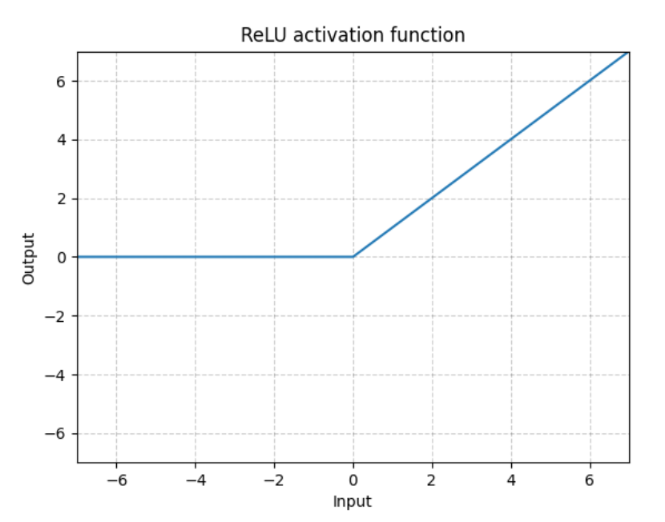

# Activation-functions(激活函数)

## WHAT is Activation-functions?

在神经元中，输入通过线性变换后，还被作用了一个非线性函数，称为激活函数。

## WHY Activation-functions?

最简单的道理，线性函数具有可加性和齐次性，所以无论多少线性层的叠加，线性网络多么复杂，最后都能转换为$\boldsymbol{Y} = \boldsymbol{X}\boldsymbol{W} + \boldsymbol{b}$。

很多问题都是非线性的，所以需要激活函数，使得神经网络具有非线性，这样才能更好的去学习。神经网络的实质就是寻找一个非线性的空间变换函数。

## Types of Activation-functions

### ReLU函数族（Rectified Linear Unit）

> **关于ReLU的引述**
>
> 几十年的机器学习发展中，我们形成了这样一个概念：非线性激活函数要比线性激活函数更加先进。
>
> 尤其是在布满Sigmoid函数的BP神经网络，布满径向基函数的SVM神经网络中，往往有这样的幻觉，非线性函数对非线性网络贡献巨大。该幻觉在SVM中更加严重。核函数的形式并非完全是SVM能够处理非线性数据的主力功臣（支持向量充当着隐层角色）。那么在深度网络中，对非线性的依赖程度就可以缩一缩。另外，在上一部分提到，稀疏特征并不需要网络具有很强的处理线性不可分机制。
>
> 综合以上两点，在深度学习模型中，使用简单、速度快的线性激活函数可能更为合适。
>
> [1]. Xu B, Wang N, Chen T, et al. Empirical evaluation of rectified activations in convolutional network[J]. arXiv preprint arXiv:1505.00853, 2015.

#### 优点

- 克服梯度消失的问题

    sigmoid有一个“梯度消失”的问题，即在|z|>4的区间梯度急剧减小，使得激活函数对z值变化的区分度下降，表达能力下降。而ReLU就没有这样的问题。

- 加快训练速度

    这类斜坡函数的运算速度明显大于指数函数等等。

#### 种类

1. ##### ReLU()

    ```
    torch.nn.functional.relu(input, inplace = False)
    ```

    实现：ReLU(x) = max(0,x)

    