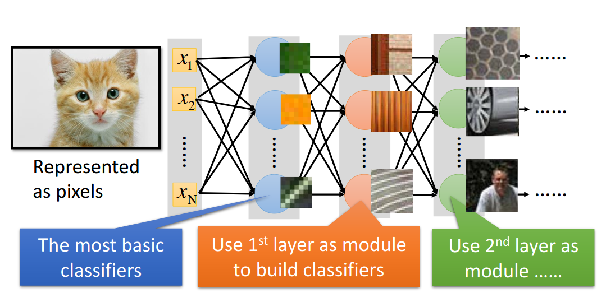
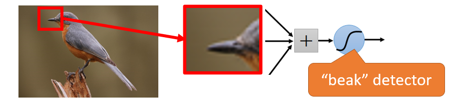
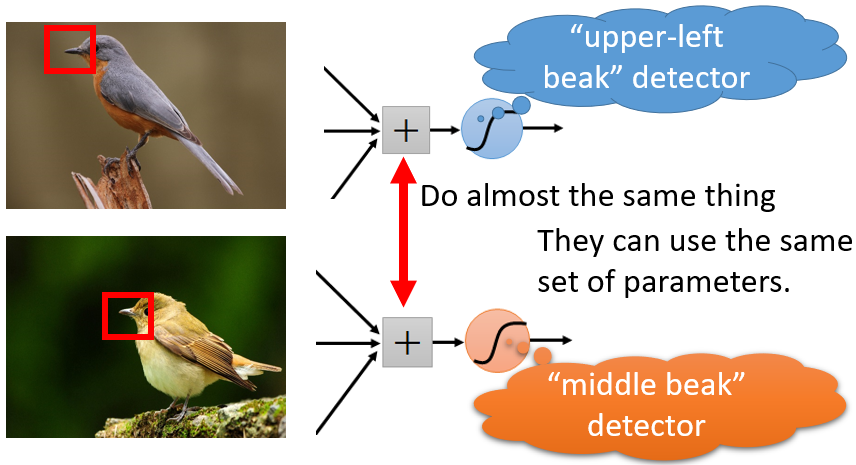
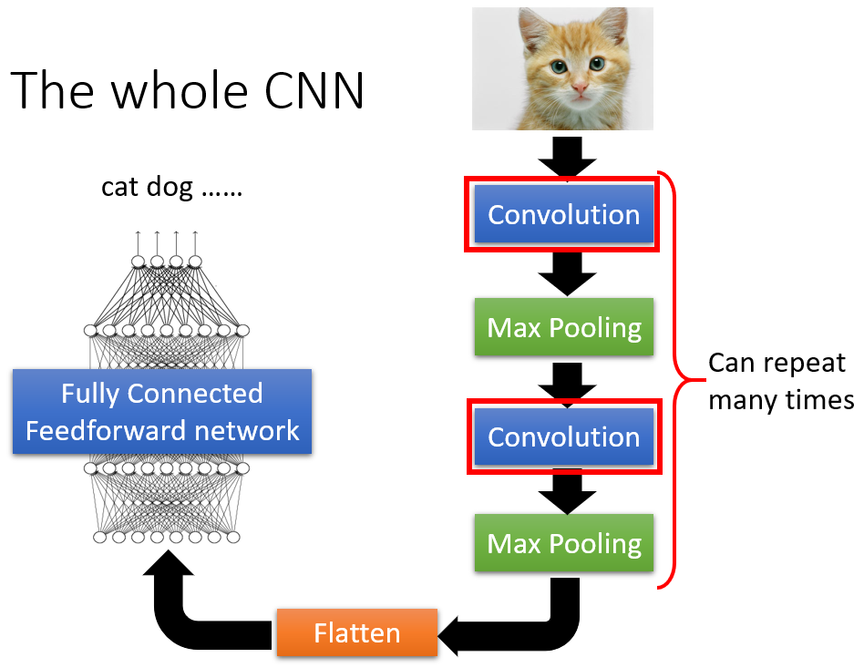

# CNN

## CONCEPT

### WHAT is CNN？

Convolutional Neural Network is a type of feedforward neural network, usually uses in the image process. 

### WHY CNN?

> In the image process，We want the neural network work like this: 
>
> 
>
> - Each neuron of the first layer is the easiest classifier to detect whether red shows or yellow or stripe...
> - Neurons of the second layer can detect more complicated things: if see straight lines and horizontal lines it'll be a part of windows, if see brown straight lines it'll be a part of the wood.
> - The third layer...

If fully connected neural network is used for the image process, a lot of parameters are needed. Actually, CNN is about to simplify the fully connected neural network and remove redundant parameters by the experience.

#### Three Property for CNN theory base

- **Some patterns are much smaller than the whole image**

    So each neuron only needs to connect a small part of the image, which removes redundant parameters.

    

- **The same patterns appear in different regions**

    The same patterns appear in different regions however they have the same shape and meaning. So we can use one neuron to detect all of them. Make the similar-functional neurons share a group of parameters removes redundant parameters.

    

- **Subsampling the pixels will not change the object**

    We can subsample the image, like remove the odd rows and the even columns. It will make the image smaller, but not influence the image process, which removes redundant parameters.

### CNN structure

Input an image, go through convolution, then max pooling, and repeat many times, then flatten, finally go to the fully connected neural network. Convolution fulfills property 1 and 2. Max pooling fulfills property 3.

#### Convolution

In the convolution layer, there are filters (matrix actually) which is like neurons in a fully connected layer. The element of them is the network parameters to be learned. So the answers to what is in the filter and what does the filter does are all from ML. 

The filter starts at the top left corner, and it will move a certain distance called stride. When it stops we do the inner product of the filter and the same-shape matrix of the image.  After a whole convolution process, it will output a small matrix, called **Feature Map**.  Each layer will output a feature map. 

Tip: CNN has a problem when patterns have different scalars.  

When we input a colorful image, which is actually a 3-D matrix, the filter is a 3-D matrix as well. The operation is the same.

##### The filter is the special neuron

## Theory

\

## Implementation