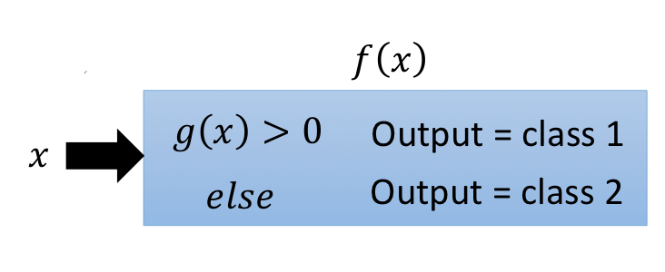

# Classification

## What?

Input: an object, need to digitize. Use a group of features to describe it.

Output: a class, which value is discrete.

## How?

Ideal Alternatives(Binary classification for example)

Model

