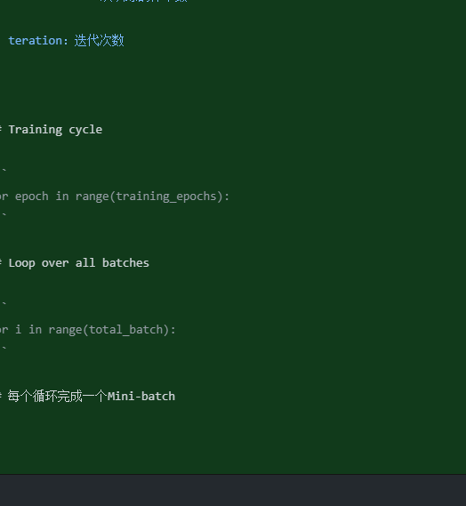

### Mini-Batch

------

基本概念

1. epoch：训练轮数

2. batch-size：一次训练的样本数

3. teration：迭代次数

 

\# Training cycle

```
for epoch in range(training_epochs):
```

\# Loop over all batches

```
for i in range(total_batch):
```

\# 每个循环完成一个Mini-batch



