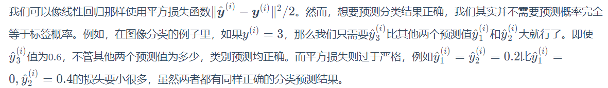

# Softmax Regression 

## 概念

输出的是一个合法的类别预测分布，满足非负和归一性，输出值个数等于标签的类别数。Softmax是一个全连接的单层神经网路。


## 模型

##### 对于单个样本 i，输入的特征值有d个，输出的标签数有q个，softmax回归的矢量计算表达式为：

${\boldsymbol{O}}^{(i)} = {\boldsymbol{x}}^{(i)}\boldsymbol{W} + \boldsymbol{b} $ （各矩阵的形状为：1\*q, 1\*d，d\*q，1\*q）

> 实现了d维到q维的线性空间变换。

${\hat{\boldsymbol{y}}}^{(i)} = softmax({\boldsymbol{O}}^{(i)})$ ，其中  $\hat{y_{1}} = P\left ( y = i \right ) = \frac{e^{O_{i}}}{\sum_{j=0}^{q-1}e^{O_{j}}}$

> 进行softmax运算，实现同维变换，输出一个合法的概率分布。

##### 对于小批量样本，输入的批量为n，softmax回归的矢量计算表达式为：

${\boldsymbol{O}} = {\boldsymbol{X}}\boldsymbol{W} + \boldsymbol{b}$ （各矩阵的形状为：n\*q, n\*d，d\*q，1\*q，加法用到广播机制）

${\hat{\boldsymbol{Y}}} = softmax({\boldsymbol{O}})$


## 损失函数

> 

交叉熵（cross entropy）是一个常用的衡量两个概率分布差异的测量函数。交叉熵只关心对正确类别的预测概率，因为只要其值足够大，就可以确保分类结果正确，对于单个样本的公式为：

$H({\boldsymbol{y}}^{(i)},{\hat{\boldsymbol{y}}}^{(i)}) = -\sum_{j=0}^{q-1}y_{j}^{(i)}\log {{\hat{y}}_{j}^{(i)}}$

如果一个样本只有一个标签，则$\boldsymbol{y}^{(i)}$中只有一个元素为1，公式可以简化为：

$H({\boldsymbol{y}}^{(i)},{\hat{\boldsymbol{y}}}^{(i)}) = -\log{{\hat{y}}_{y^{j}}^{(i)}}$

对于多个样本的交叉熵损失函数为：

$l(\boldsymbol{\Theta} ) = \frac{1}{n}\sum H({\boldsymbol{y}}^{(i)},{\hat{\boldsymbol{y}}}^{(i)})$


## Pytorch实现

```python
loss = class torch.nn.CrossEntropyLoss(input, target, weight=None, size_average=True)
```

> 该方法将`LogSoftMax`和`NLLLoss`集成到一个类中，用于训练多类分类器，完成softmax，求log，求交叉熵的步骤。
>
> weight(tensor)：`1-D` tensor，n个元素，分别代表第n类的权重，如果训练样本很不均衡的话，是非常有用的。
>
> 调用时参数：
>
> - input : 经过线性空间变换后得到的`2-D` tensor，shape为 n\*q，即为模型中的${\boldsymbol{O}}$。
> - target: 大小为 n的 `1—D`tensor，包含类别的索引(0到n-1)。


## 实例

```python
import torch
from torchvision import transforms
from torchvision import datasets
from torch.utils.data import DataLoader
import torch.nn.functional as F
import torch.optim

batch_size = 64
# 定义dataloader需要的批量参数
transform = transforms.Compose([
transforms.ToTensor(),
transforms.Normalize((0.1307, ), (0.3081, ))
])
# 处理图片样本数据，对于MNIST数据集有经验均值和标准差
train_dataset = datasets.MNIST(root='../dataset/mnist/',
train=True,
download=True,
transform=transform)
train_loader = DataLoader(train_dataset,
shuffle=True,
batch_size=batch_size)
test_dataset = datasets.MNIST(root='../dataset/mnist/',
train=False,
download=True,
transform=transform)
test_loader = DataLoader(test_dataset,
shuffle=False,
batch_size=batch_size)
# Design Model
class Net(torch.nn.Module):
	def __init__(self):
		super(Net, self).__init__()
		self.l1 = torch.nn.Linear(784, 512)
		self.l2 = torch.nn.Linear(512, 256)
		self.l3 = torch.nn.Linear(256, 128)
		self.l4 = torch.nn.Linear(128, 64)
		self.l5 = torch.nn.Linear(64, 10)
	def forward(self, x):
		x = x.view(-1, 784)
		x = F.relu(self.l1(x))
		x = F.relu(self.l2(x))
		x = F.relu(self.l3(x))
		x = F.relu(self.l4(x))
	return self.l5(x)

model = Net()
# Construct loss and Optimizer
loss = torch.nn.CrossEntropyLoss()
optimizer = torch.optim.SGD(model.parameters(), lr=0.01, momentum=0.5)
```


