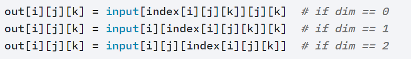
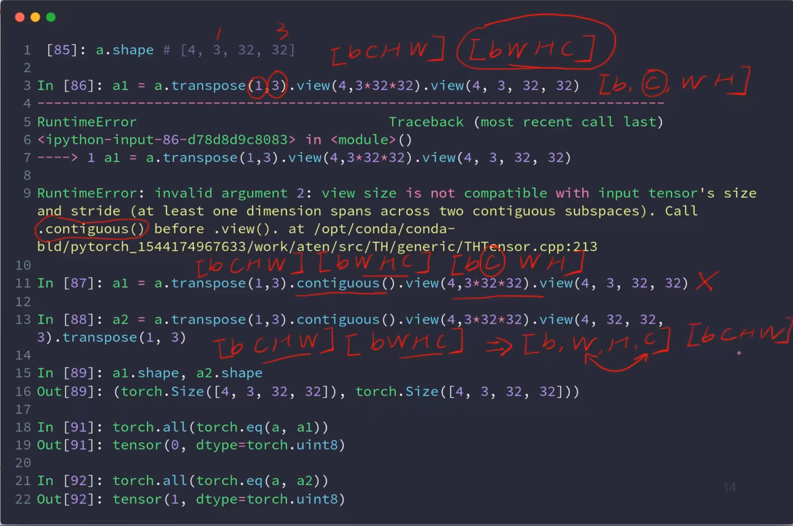
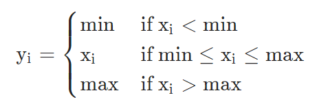
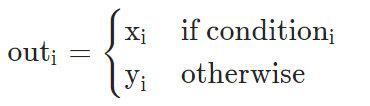

# Tensor

[Data type](#data-type)

[Creating](#creating)

[Index](#index)

[Shape](#shape)

[Merge or split](#merge-or-split)

[Broadcast](#broadcast)

[Math Operation](#math-operation)

[Approximation](#approximation)

[Statistics](#statistics)

[Comparing](#comparing)

[Others](#other)


To almost all APIs, torch.add(input,y) = input.add(y).

Update:

- x.add(y): the data of x holds, and the API will return a new tensor.
- x.add_(y): update x.

[Tensor](#tensor)


## Data type

*Back to [Tensor](#tensor)*

Everything is a tensor in pytorch. 

### How to denote string

There is no string type in pytorch, only create one  by coding like: 

One-hot: [0,1,0,0,1...]

Embedding: Word2vec, glove. 	

### Data type in Pytorch

| Data type                | dtype                             | CPU tensor              | GPU tensor                  |
| ------------------------ | --------------------------------- | ----------------------- | --------------------------- |
| 32-bit floating point    | `torch.float32` or `torch.float`  | **`torch.FloatTensor`** | `torch.cuda.FloatTensor`    |
| 64-bit floating point    | `torch.float64` or `torch.double` | `torch.DoubleTensor`    | `torch.cuda.DoubleTensor`   |
| 16-bit floating point 1  | `torch.float16` or `torch.half`   | `torch.HalfTensor`      | `torch.cuda.HalfTensor`     |
| 16-bit floating point 2  | `torch.bfloat16`                  | `torch.BFloat16Tensor`  | `torch.cuda.BFloat16Tensor` |
| 8-bit integer (unsigned) | `torch.uint8`                     | **`torch.ByteTensor`**  | `torch.cuda.ByteTensor`     |
| 8-bit integer (signed)   | `torch.int8`                      | `torch.CharTensor`      | `torch.cuda.CharTensor`     |
| 16-bit integer (signed)  | `torch.int16` or `torch.short`    | `torch.ShortTensor`     | `torch.cuda.ShortTensor`    |
| 32-bit integer (signed)  | `torch.int32` or `torch.int`      | **`torch.IntTensor`**   | `torch.cuda.IntTensor`      |
| 64-bit integer (signed)  | `torch.int64` or `torch.long`     | `torch.LongTensor`      | `torch.cuda.LongTensor`     |
| Boolean                  | `torch.bool`                      | `torch.BoolTensor`      | `torch.cuda.BoolTensor`     |


## Creating

### Keyword Arguments

`dtype`: Desires data type. If None, uses a global default. 

`size`(tuple): defines the shape of the output tensor.


```python
torch.from_numpy()
```

Turns an array to a tensor.

```python
torch.tensor(data,dtype=None)
```

Returns a tensor with pre-existing data. The tensor’s `dtype` is inferred from `data`.

tensor(1): creates a 0-D tensor with one element.

tensor([[1]]): creates a 2-D tensor with one element.

`dtype`: If None, infers data type from `data`.

```python
torch.Tensor(*sizes)
```

Returns a tensor with specific `size`, using the column 3,4 in the data type tabular. The data is uninitialized.

```python
torch.set_default_tensor_type(torch.DoubleTensor)
```

Changes the default type, which is `torch.float` before.

```python
*_like(input)
```

Returns a tensor with the same size as `input`, like `torch.rand_like`

```python
torch.rand(*size,dtype=None)
```

Returns a tensor filled with random numbers from a uniform distribution on [0,1).

```python
torch.randint(low=0, high, size)
```

Returns a tensor filled with random integers generated uniformly on  [`low`,`high`).

```python
torch.randn(*size)
```

Returns a tensor filled with random numbers from a normal distribution with mean 0 and variance 1.

```python
torch.full(size, fill_value)
```

Creates a tensor of  `size` filled with `fill_value`. The tensor’s `dtype` is inferred from `fill_value`.

```python
torch.arange(start=0, end, step=1)
```

Returns a 1-D tensor with values from [start, end)  taken with common difference `step` beginning from start.

```python
torch.linspace(start, end, steps)
```

Returns a 1-D tensor of size `steps` whose values are evenly spaced from [start, end] . 

```python
torch.ones/zeros(*size)
```

Returns a tensor filled with the scalar value 1/0.

```python
torch.eye(n, m=None)
```

Returns a 2-D tensor with ones on the diagonal and zeros elsewhere.

n(int): the number of rows, m(int):　the number of columns with default n.

```python
torch.randperm(n)
```

Returns a random permutation of integers from `0` to `n - 1`.

Use this to create a random index.


## Index

### Slice operation

```python
a[m1:n1:s1,m2:n2:s2,…]
```

For each dimension, index from m, to n( not included) with step s.

```python
a[d1,...,d2]
```

`...`means` : , : , : ···`, the number of dimension `...`represents will get automatically. 


```python
torch.index_select(input, dim, index)
```

Returns a new tensor which indexes the `input` tensor along dimension `dim` using the index in `index` which is a LongTensor.

```python
torch.masked_select(input, mask)
```

Returns a new 1-D tensor which indexes the `input` tensor according to  `mask` which is a BoolTensor. 

The shapes of the `mask` tensor and the `input` tensor don’t need to match, but they must be broadcastable.

```python
torch.gather(input, dim, index)
```

Gathers values by the indices of elements on dimension `dim`. It is like to establish 1-D mapping on dimension `dim`. 

The dimension of input and index must match, and the size of each dimension must match except dimension`dim`. 




## Shape

### Shape Check

```python
a.type(dtype=None) 
```

Returns the type if `dtype` is not provided, else casts this object to the specified type.

```python
isinstance(a, torch.FloatTensor)
```

Detects whether the type is correct. Returns a bool. 

```python
a.cuda()
```

Moves a tensor to GPU.

```python
a.shape
```

Returns an object like 'torch.Size([d1,d2,...])'. Use `a.shape[x]` to return the value of Index[x].

```python
len(a.shape)
```

Returns the dimension, like a is a 2-D tensor. 

```python
a.size()
```

Calls a function to return the size. Use `a.size(x)` to return the value of Index[x].

```python
list(a.shape)
```

Turns a shape to a list. 

```python
a.numel()
```

Returns the total number of elements.

```python
a.dim()
```

Returns the dimension.


### Dimensional Transformation

```python
a.view(*shape)
```

Returns a new tensor with the same data as the `self` tensor but of a different `shape`.

The returned tensor shares the same data and must have the same number of elements.

the size -1 is inferred from other dimensions.

This API does not change tensor layout in memory. 

```python
torch.reshape(input, shape)
```

Similar with view. 

When possible, the returned tensor will be a view of `input`. Otherwise, it will be a copy, which will change the data.

```python
torch.unsqueeze(input, dim)
```

Returns a new tensor with a dimension of size one inserted at the specified position.

The returned tensor shares the same underlying data with this tensor.


```python
torch.squeeze(input, dim=None)
```

Returns a tensor with size 1 removed. When `dim`=None, remove all size1.

```python
expand(*sizes)
```

Returns a new view of the `self` tensor with dimensions of size 1 expanded to a larger size.

Passing -1 as the size for a dimension means not changing the size of that dimension.

```python
torch.transpose(input, dim0, dim1)
```

Swap `dim0` and `dim1 `.

Note that the tensor layout will change. 

> 
>
> From the example it can be clearly understand that view won't change the layout but transpose will, and view will lose the dimension information but transpose won't. 

```python
permute(*dims)
```

Do transpose until the dimensions are in order of `dims`.


## Merge or split

```python
torch.cat(seq, dim=0)
```

Concatenates the given sequence of `seq` tensors in the dimension `dim`. All tensors must either have the same shape (except in the concatenating dimension) or be empty.

`seq`: (tensor_a, tensor_b,...)

```python
torch.stack(seq, dim=0)
```

Concatenates a sequence of tensors by inserting a new dimension.

All tensors need to be of the same size.

```python
torch.split(input, split_size_or_sections, dim=0)
```

Returns a tuple of tensors splitting by lens from the input tensor.

`split_size_or_sections`(int or list[int]): How to split

`dim`: Where to split

```python
torch.chunk(input, chunks, dim=0)
```

Returns a tuple of tensors splitting by numbers from the input.

`chunks`: Number of tensors to return.




## Broadcast

### What is broadcast? 

Expand automatically without copying data.

### Why broadcast?

- For actual demanding

    like [class, student, scores], add bias for everyone. Make `[4,32,90] + [5]` legal.

- Memory consumption

### How to broadcast?

MATCH from the last dim! 

If current dim = 1, expand to the same size.

If either has no dim, insert 1dim and expand to the same size.

Otherwise, it's not broadcastable. 


## Math Operation

```python
.t()
```

Returns the transpose of a matrix(Note that 2-D only)

```python
torch.matmul(input, other)
# = @
```

Matrix product of two tensors. (always operation on Dimension -1 and Dimension -2. )

2-D: two tensors must be broadcastable except Dimension -1 and Dimension -2. 


## Approximation

```python
torch.floor(input)
```

Returns a new tensor with the largest integers less than the elements of `input`. 

```python
torch.ceil(input)
```

Returns a new tensor with the smallest integers greater than or equal to the elements of `input`

```python
torch.round(input)
```

Returns a new tensor with each of the elements of `input` rounded to the closest integer.

```python
torch.trunc(input)
```

Returns a new tensor with only integer part of input's elements.

```python
torch.frac(input)
```

Returns a new tensor with only decimal part of input's elements.

```python
torch.clamp(input, min, max)
```


## Statistics

### Keyword Arguments

`keepdim` (bool): If `keepdim` is `True`, the output tensor is of the same size as `input` except in the dimension(s) `dim` where it is of size 1. Otherwise, `dim` is squeezed.


```python
torch.linalg.norm(input)
```

Returns the matrix norm or vector norm.

| ord   | norm for matrices            | norm for vectors            |
| ----- | ---------------------------- | --------------------------- |
| None  | Frobenius norm               | 2-norm                      |
| ’fro’ | Frobenius norm               | – not supported –           |
| ‘nuc’ | nuclear norm                 | – not supported –           |
| inf   | max(sum(abs(x), dim=1))      | max(abs(x))                 |
| -inf  | min(sum(abs(x), dim=1))      | min(abs(x))                 |
| 0     | – not supported –            | sum(x != 0)                 |
| 1     | max(sum(abs(x), dim=0))      | as below                    |
| -1    | min(sum(abs(x), dim=0))      | as below                    |
| 2     | 2-norm (largest sing. value) | as below                    |
| -2    | smallest singular value      | as below                    |
| other | – not supported –            | sum(abs(x)\**ord)**(1./ord) |

**`dim`**: If `dim` is an int, vector norm will be calculated over the specified dimension. If `dim` is a 2-tuple of ints, matrix norm will be calculated over the specified dimensions. If `dim` is None, matrix norm will be calculated when the input tensor has two dimensions, and vector norm will be calculated when the input tensor has one dimension. 

```python
torch.max(input, dim, keepdim=False)
torch.min(inpuy, dim, keepdim=False)
```

If dim is not given, returns the max element.

Else Returns a namedtuple `(values, indices)` where `values` is the maximum value of each row of the `input` tensor in the given dimension `dim`. And `indices` is the index location of each maximum value found (argmax).

```python
a.arggmax()
a.argmin()
```

Returns a `LongTensor` that is the indices of the maximum value of all elements in the `input` tensor. It's the second value returned by torch.max()

```python
torch.sum(input, dim, keepdim=False)
torch.prod(input, dim, keepdim=False)
# Mulitply
torch.mean(input, dim, keepdim=False)
# Mean
```

Returns the sum of each row of the `input` tensor in the given dimension `dim`. 

`dim` (int or tuple): If `dim` is not given, sum up all elements. 

```python
torch.topk(input, k, dim=None, largest=True)
```

Returns a namedtuple of (values, indices) where values are the `k` largest elements along dimension `dim`. 

If `largest=False` : returns smallest instead.

```python
torch.kthvalue(input, k, dim=None, keepdim=False)
```

Returns a namedtuple `(values, indices)` where `values` is the `k` th smallest element of each row of the `input` tensor in the given dimension `dim`.


## Comparing

```python
torch.ge(input, other)
```

Computes input ≥ other element-wise.

`other`: can be a number or a tensor and the  shapes of `other` and `input` don’t need to match, but they must be broadcastable.

```python
a.all()
```

Returns True if all elements in the tensor are True.

```python
torch.eq(input, other)
```

Computes element-wise equality. Returns a boolean tensor.

```python
torch.all(torch.eq(a,b))
```

If a = b totally, returns 1, else returns 0.


## Others

```python
torch.where(condition, x, y)
```

Return a tensor of elements selected from either `x` or `y`, depending on `condition`.



```python
contiguous(memory_format=torch.contiguous_format)
```

Returns a contiguous in memory tensor containing the same data as `self` tensor.