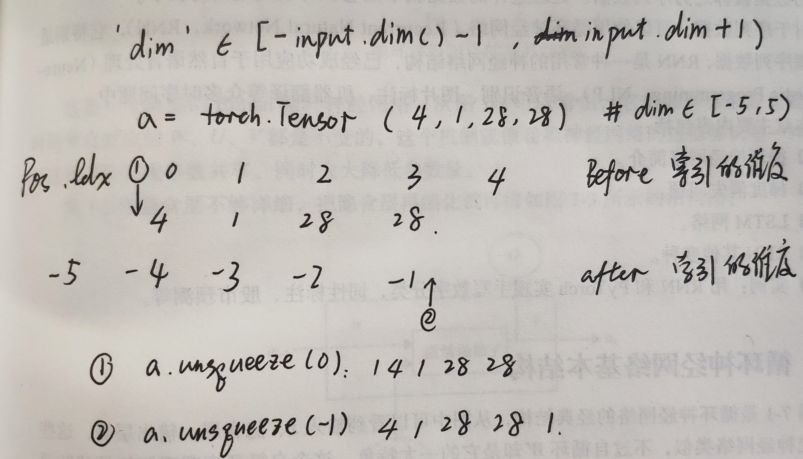

# Tensor

To almost all APIs, torch.add(x,y) = x.add(y).

Update:

- x.add(y): the data of x holds, and the API will return a new tensor.
- x.add_(y): update x.

## Data type

Everything is a tensor in pytorch. 

### How to denote string

There is no string type in pytorch, only create one  by coding like: 

One-hot: [0,1,0,0,1...]

Embedding: Word2vec, glove. 	

### Data type in pytorch

| Data type                | dtype                             | CPU tensor              | GPU tensor                  |
| ------------------------ | --------------------------------- | ----------------------- | --------------------------- |
| 32-bit floating point    | `torch.float32` or `torch.float`  | **`torch.FloatTensor`** | `torch.cuda.FloatTensor`    |
| 64-bit floating point    | `torch.float64` or `torch.double` | `torch.DoubleTensor`    | `torch.cuda.DoubleTensor`   |
| 16-bit floating point 1  | `torch.float16` or `torch.half`   | `torch.HalfTensor`      | `torch.cuda.HalfTensor`     |
| 16-bit floating point 2  | `torch.bfloat16`                  | `torch.BFloat16Tensor`  | `torch.cuda.BFloat16Tensor` |
| 8-bit integer (unsigned) | `torch.uint8`                     | **`torch.ByteTensor`**  | `torch.cuda.ByteTensor`     |
| 8-bit integer (signed)   | `torch.int8`                      | `torch.CharTensor`      | `torch.cuda.CharTensor`     |
| 16-bit integer (signed)  | `torch.int16` or `torch.short`    | `torch.ShortTensor`     | `torch.cuda.ShortTensor`    |
| 32-bit integer (signed)  | `torch.int32` or `torch.int`      | **`torch.IntTensor`**   | `torch.cuda.IntTensor`      |
| 64-bit integer (signed)  | `torch.int64` or `torch.long`     | `torch.LongTensor`      | `torch.cuda.LongTensor`     |
| Boolean                  | `torch.bool`                      | `torch.BoolTensor`      | `torch.cuda.BoolTensor`     |


## Creating

### Keyword Arguments

`dtype`: Desires data type. If None, uses a global default. 

`size`(tuple): defines the shape of the output tensor.

### API 	

```python
torch.from_numpy()
```

Turns an array to a tensor.

```python
torch.tensor(data,dtype=None)
```

Returns a tensor with pre-existing data. The tensor’s `dtype` is inferred from `data`.

tensor(1): creates a 0-D tensor with one element.

tensor([[1]]): creates a 2-D tensor with one element.

`dtype`: If None, infers data type from `data`.

```python
torch.Tensor(*sizes)
```

Returns a tensor with specific `size`, using the column 3,4 in the data type tabular. The data is uninitialized.

```python
torch.set_default_tensor_type(torch.DoubleTensor)
```

Changes the default type, which is `torch.float` before.

```python
*_like(input)
```

Returns a tensor with the same size as `input`, like `torch.rand_like`

```python
torch.rand(*size,dtype=None)
```

Returns a tensor filled with random numbers from a uniform distribution on [0,1).

```python
torch.randint(low=0, high, size)
```

Returns a tensor filled with random integers generated uniformly on  [`low`,`high`).

```python
torch.randn(*size)
```

Returns a tensor filled with random numbers from a normal distribution with mean 0 and variance 1.

```python
torch.full(size, fill_value)
```

Creates a tensor of  `size` filled with `fill_value`. The tensor’s `dtype` is inferred from `fill_value`.

```python
torch.arange(start=0, end, step=1)
```

Returns a 1-D tensor with values from [start, end)  taken with common difference `step` beginning from start.

```python
torch.linspace(start, end, steps)
```

Returns a 1-D tensor of size `steps` whose values are evenly spaced from [start, end] . 

```python
torch.ones/zeros(*size)
```

Returns a tensor filled with the scalar value 1/0.

```python
torch.eye(n, m=None)
```

Returns a 2-D tensor with ones on the diagonal and zeros elsewhere.

n(int): the number of rows, m(int):　the number of columns with default n.

```python
torch.randperm(n)
```

Returns a random permutation of integers from `0` to `n - 1`.

Use this to create a random index.


## Indexing

### Slice operation

```python
a[m1:n1:s1,m2:n2:s2,…]
```

For each dimension, index from m, to n( not included) with step s.

```python
a[d1,...,d2]
```

`...`means` : , : , : ···`, the number of dimension `...`represents will get automatically. 

### API

```python
torch.index_select(input, dim, index)
```

Returns a new tensor which indexes the `input` tensor along dimension `dim` using the index in `index` which is a LongTensor.

```python
torch.masked_select(input, mask)
```

Returns a new 1-D tensor which indexes the `input` tensor according to  `mask` which is a BoolTensor. 

The shapes of the `mask` tensor and the `input` tensor don’t need to match, but they must be broadcastable.

## About shape

```python
a.type(dtype=None) 
```

Returns the type if `dtype` is not provided, else casts this object to the specified type.

```python
isinstance(a, torch.FloatTensor)
```

Detects whether the type is correct. Returns a bool. 

```python
a.cuda()
```

Moves a tensor to GPU.

```python
a.shape
```

Returns an object like 'torch.Size([d1,d2,...])'. Use `a.shape[x]` to return the value of Index[x].

```python
len(a.shape)
```

Returns the dimension, like a is a 2-D tensor. 

```python
a.size()
```

Calls a function to return the size. Use `a.size(x)` to return the value of Index[x].

```python
list(a.shape)
```

Turns a shape to a list. 

```python
a.numel()
```

Returns the total number of elements.

```python
a.dim()
```

Returns the dimension.


### Transformation

```python
a.view(*shape)
```

Returns a new tensor with the same data as the `self` tensor but of a different `shape`.

The returned tensor shares the same data and must have the same number of elements.

the size -1 is inferred from other dimensions.

This API does not change tensor layout in memory. 

```python
torch.reshape(input, shape)
```

Similar with view. 

When possible, the returned tensor will be a view of `input`. Otherwise, it will be a copy.

```python
torch.unsqueeze(input, dim)
```

Returns a new tensor with a dimension of size one inserted at the specified position.

The returned tensor shares the same underlying data with this tensor.




```python
​```python

​```
```


## Comparing

```python
torch.ge(input, other)
```

Computes input ≥ other element-wise.

`other`: can be a number or a tensor and the  shapes of `other` and `input` don’t need to match, but they must be broadcastable.


#### view(*args)

返回一个有相同数据但大小不同的tensor，参数中允许有一个-1，系统将自动计算该值，使得参数连乘等于原Tensor元素相同。