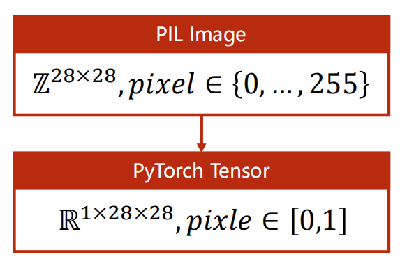

# Torchvision

### torchvision.transforms

常见的**数据预处理**及**数据增强**操作都可以通过该接口实现。

- ### ToTensor()

    Convert a `PIL Image` or `numpy.ndarray` to `tensor`

- ### Normalize(mean,std)

    给定均值(R, G, B) 和方差(R, G, B) ，把tensor数据归一化处理。

- ### Compose([ t1, t2])

    将多个transforms组合起来使用。

## torchvision.datasets

包含了常用的数据集，提供数据集设置的一些重要参数设置，可以通过简单数据集设置来进行数据集的调用。

`Datasets`是 `torch.utils.data.Dataset`的子类，可以通过`torch.utils.data.DataLoader`使用多线程（python的多进程）。

- ### MNIST(root, train=**True**, transform=**None**, target_transform=**None**, download=**False**)

    root='../dataset/mnist'存放地址，train：区分训练集和测试集，transform：需要做的转换操作。